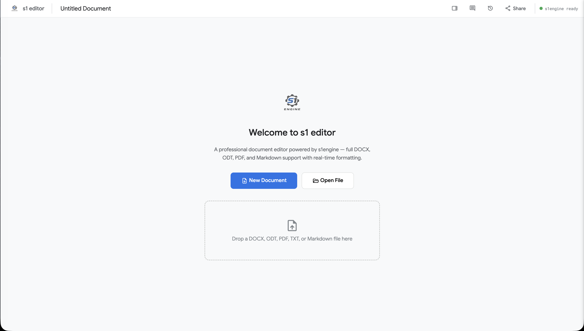
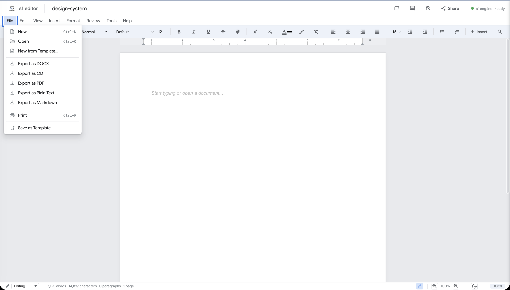
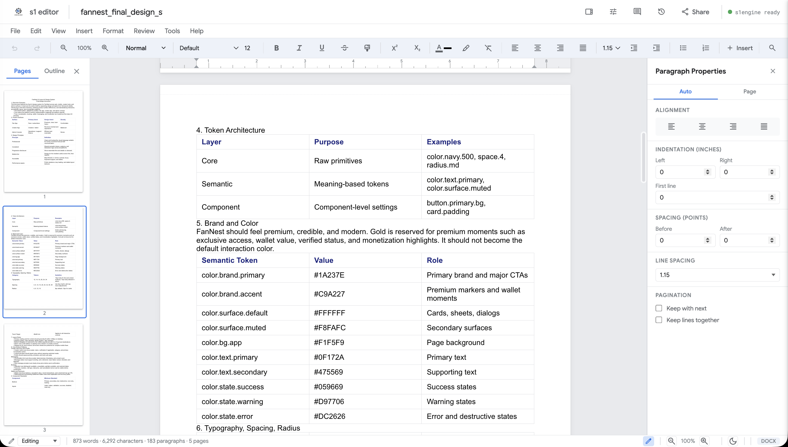
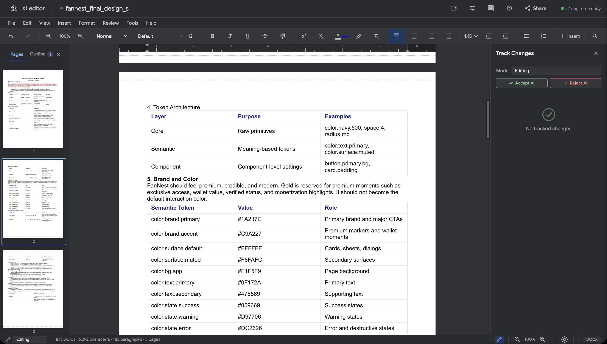

# s1engine

[](https://github.com/schnsrw/s1engine/actions)
[](LICENSE)

A modular document engine SDK built in pure Rust. Read, write, edit, and convert documents across DOCX, ODT, PDF, TXT, and Markdown formats — with CRDT-based collaboration, a page layout engine, and a browser-based editor.

**1,390+ tests** · **Zero C/C++ dependencies** · **AGPL-3.0**

> **[Format Compatibility & Known Limitations](docs/COMPATIBILITY.md)** — what works, what's partial, what's not supported.

## What is s1engine?

s1engine is a modular Rust SDK that powers document workflows across desktop, server, and web. It combines format conversion (DOCX, ODT, PDF, TXT, Markdown), a Fugue CRDT core for collaboration, and native/WASM/FFI bindings so the same engine can be embedded in editors, clients, and services.

## Highlights

- **Multi-format** — DOCX, ODT, PDF, TXT, Markdown, and legacy DOC (read)
- **Pure Rust** — Zero C/C++ dependencies. Compiles to native, WASM, and C FFI
- **Collaborative** — Fugue CRDT for multi-user editing with conflict resolution
- **Layout engine** — Pagination, text shaping (rustybuzz), font subsetting, PDF export
- **Web editor** — S1 Editor: browser-based document editor with toolbar, comments, track changes, and PDF viewer
- **Embeddable** — Use as a Rust library, WASM module, or C shared library

## Quick Start

### As a Rust Library

Add to your `Cargo.toml`:

```toml
[dependencies]
s1engine = "1.0.1"

# Optional features
# s1engine = { version = "1.0.1", features = ["pdf", "crdt", "convert"] }
```

Open and read a document:

```rust
use s1engine::Engine;

let engine = Engine::new();
let data = std::fs::read("report.docx")?;
let doc = engine.open(&data)?;

println!("{}", doc.to_plain_text());
println!("Title: {:?}", doc.metadata().title);
```

Create a document programmatically:

```rust
use s1engine::{DocumentBuilder, Format};

let doc = DocumentBuilder::new()
    .title("Quarterly Report")
    .author("Engineering")
    .heading(1, "Introduction")
    .paragraph(|p| {
        p.text("Built with ")
         .bold("s1engine")
         .text(" — a document SDK in Rust.")
    })
    .table(|t| {
        t.row(|r| r.cell("Metric").cell("Value"))
         .row(|r| r.cell("Users").cell("15,000"))
    })
    .build();

let docx = doc.export(Format::Docx)?;
let pdf = doc.export(Format::Pdf)?;  // requires "pdf" feature
```

Convert between formats:

```rust
let engine = Engine::new();
let doc = engine.open_file("input.docx")?;
std::fs::write("output.odt", doc.export(Format::Odt)?)?;
```

### Feature Flags

| Feature | Description | Default |
|---|---|---|
| `docx` | DOCX (OOXML) read/write | Yes |
| `odt` | ODT (ODF) read/write | Yes |
| `txt` | Plain text read/write | Yes |
| `md` | Markdown read/write (GFM tables) | Yes |
| `pdf` | PDF export with font embedding | No |
| `convert` | Format conversion pipelines | No |
| `doc-legacy` | Legacy DOC binary parsing | No |
| `crdt` | CRDT collaboration primitives | No |

## S1 Editor

S1 Editor is the WASM-powered web interface that lets teams collaborate on DOCX, ODT, PDF, TXT, and Markdown content through the same engine used in the Rust SDK. Multi-page layout, annotations, track-changes, and export tools appear inside the browser canvas while Fugue CRDT keeps collaborators in sync.

### Experience highlights

- **Layout and rendering** — Multi-page, paginated canvas with measured text shaping and consistent spacing (see the layout screenshot).
- **Toolbar & styling** — Unified formatting toolbar, templates, and table/insert controls keep rich editing easily accessible.
- **Collaboration & comments** — Inline mentions, comments, and presence indicators sync through the network-backed CRDT relay.
- **Track changes** — Accept/reject controls, history detail, and blame context surface editorial intent.
- **PDF + export** — Built-in PDF viewer/annotator (highlight, draw, markup) plus DOCX/ODT/PDF/TXT/Markdown export pipelines.
- **Developer-ready** — Keyboard shortcuts, drag-and-drop importing, dark mode, WASM bindings, and Docker deployments keep integration painless.

### Running the Editor

```bash
# Prerequisites: Rust, wasm-pack, Node.js 18+

# Build WASM bindings
make wasm

# Start development server
cd editor && npm install && npm run dev
```

Open `http://localhost:3000` in your browser.

### Docker

```bash
# Build and run with Docker
make docker-build
make docker-run

# Or use Docker Compose
docker compose up
```

The editor is served at `http://localhost:8787`.

### Experience gallery

| Upload & landing | Toolbar & controls |
|-------------------|---------------------|
| <br>_Landing canvas for drag-and-drop files, templates, and import workflows._ | <br>_Formatting toolbar featuring paragraph styles, tables, lists, and insert tools._ |
| Document view | Track changes panel |
| <br>_Light-mode document canvas with paragraph properties and layout controls exposed._ | <br>_Dark track changes inspector with accept/reject, comment context, and comparison indicators._ |

## Architecture

```
Consumer Applications
        |  Rust API / C FFI / WASM
+-------v--------------------------------------------+
|                s1engine (facade)                    |
|----------------------------------------------------|
|  s1-ops       s1-layout       s1-convert           |
|  Operations   Page Layout     Format Conversion    |
|  Undo/Redo    Pagination      DOC -> DOCX          |
|----------------------------------------------------|
|  s1-crdt                s1-model                   |
|  Collaborative          Core Document Model        |
|  Editing (Fugue)        (zero external deps)       |
|----------------------------------------------------|
|  format-docx  format-odt  format-pdf  format-txt   |
|  format-md                                         |
|----------------------------------------------------|
|                s1-text (Pure Rust)                  |
|        rustybuzz  ttf-parser  fontdb               |
+----------------------------------------------------+
```

## Crate Structure

| Crate | Description |
|---|---|
| `s1engine` | Facade — high-level public API |
| `s1-model` | Core document model (zero external deps) |
| `s1-ops` | Operations, transactions, undo/redo |
| `s1-format-docx` | DOCX (OOXML) reader/writer |
| `s1-format-odt` | ODT (ODF) reader/writer |
| `s1-format-md` | Markdown reader/writer |
| `s1-format-pdf` | PDF export + editing (via lopdf) |
| `s1-format-txt` | Plain text reader/writer |
| `s1-convert` | Format conversion (DOC binary + cross-format) |
| `s1-layout` | Page layout, pagination, text shaping |
| `s1-text` | Font loading, shaping, Unicode (pure Rust) |
| `s1-crdt` | CRDT algorithms for collaboration |
| `ffi/wasm` | WASM bindings (wasm-bindgen) |
| `ffi/c` | C FFI bindings (cbindgen) |

## Building from Source

### Prerequisites

- Rust 1.88+ (`rustup install stable`)
- For WASM: `wasm-pack` (`cargo install wasm-pack`)
- For editor: Node.js 18+ and npm
- For Docker: Docker 20+

### Build & Test

```bash
# Build all crates
cargo build --workspace

# Run all tests (1,380+ tests)
cargo test --workspace

# Lint
cargo clippy --workspace -- -D warnings

# Format check
cargo fmt --check
```

### Makefile Targets

```bash
make build          # Build all crates (debug)
make build-release  # Build all crates (release)
make test           # Run all tests
make clippy         # Lint with clippy
make fmt            # Format code
make check          # fmt + clippy + tests
make wasm           # Build WASM bindings (debug)
make wasm-release   # Build WASM bindings (release)
make demo           # Build WASM + start editor
make docker-build   # Build Docker image
make docker-run     # Run Docker container
make clean          # Clean build artifacts
```

## Format Support

| Feature | DOCX | ODT | Markdown | PDF | TXT | DOC |
|---|---|---|---|---|---|---|
| Read | Yes | Yes | Yes | View* | Yes | Partial |
| Write | Yes | Yes | Yes | Export | Yes | — |
| Round-trip | Yes | Yes | Partial | — | Yes | — |
| Paragraphs | Yes | Yes | Yes | Export | Lossy | Yes |
| Tables | Yes | Yes | GFM | Export | Tab-sep | Partial |
| Images | Yes | Yes | — | Export | — | — |
| Lists | Yes | Yes | Yes | — | Markers | — |
| Styles | Yes | Yes | — | Export | — | Partial |
| Comments | Yes | Yes | — | — | — | — |
| Headers/Footers | Yes | Yes | — | Export | — | — |
| Hyperlinks | Yes | Yes | Yes | Export | — | — |
| Track Changes | Yes | — | — | — | — | — |

*PDF viewing is available in S1 Editor via PDF.js integration.

## Documentation

| Document | Description |
|---|---|
| [Architecture](docs/ARCHITECTURE.md) | System design, crate structure, core decisions |
| [Specification](docs/SPECIFICATION.md) | Detailed technical spec for every module |
| [API Design](docs/API_DESIGN.md) | Public API surface, feature flags, examples |
| [Roadmap](docs/ROADMAP.md) | Development phases and milestones |
| [Dependencies](docs/DEPENDENCIES.md) | External libraries with rationale |
| [WASM Design](docs/WASM_DESIGN.md) | WASM bindings, rendering modes, font handling |
| [Contributing](CONTRIBUTING.md) | How to contribute to the project |
| [Changelog](CHANGELOG.md) | Release history |

## Contributing

We welcome contributions. See [CONTRIBUTING.md](CONTRIBUTING.md) for guidelines.

**Quick overview:**

1. Fork the repository
2. Create a feature branch (`git checkout -b feature/my-feature`)
3. Make your changes (follow the coding conventions in CLAUDE.md)
4. Run `make check` to verify tests, clippy, and formatting
5. Submit a pull request

## License

Licensed under the [GNU Affero General Public License v3.0](LICENSE) (AGPL-3.0-or-later).

For commercial licensing options (proprietary use without AGPL obligations), contact the maintainers.

## Acknowledgments

s1engine uses these pure-Rust libraries:

- [rustybuzz](https://github.com/RazrFalcon/rustybuzz) — Text shaping (HarfBuzz port)
- [ttf-parser](https://github.com/RazrFalcon/ttf-parser) — Font parsing
- [fontdb](https://github.com/RazrFalcon/fontdb) — Font discovery
- [pdf-writer](https://github.com/typst/pdf-writer) — PDF generation
- [lopdf](https://github.com/J-F-Liu/lopdf) — PDF reading/editing
- [quick-xml](https://github.com/tafia/quick-xml) — XML parsing
- [pulldown-cmark](https://github.com/raphlinus/pulldown-cmark) — Markdown parsing
